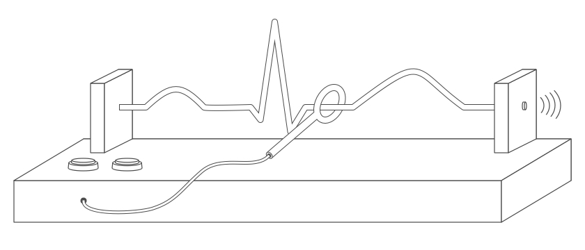

# DKF BUZZ-WIRE GAME
The Department of Clinical Research of the University Hospital Basel will present
itself at the Uninacht 2015 (Night of the University) to the public with a "mock"
clinical study.

The study intervention is comprised of performing a buzz-wire game. All participants
will be randomly split into two groups (using a wheel of fortune).

One group will perform the buzz-wire regularly, whereas the other group will
first turn themselves around by 1080 degree (3 full turns).

Performance on the buzz-wire game will be measured by the time needed to finish
the game and by the amount of contacts made with the wire.

In addition the gender of the participant will be recorded (to analyze for gender
influence on the result).

To compare the two groups, we will calculate a game score for each participant:

1. Starting score 25 points
2. Add the number of seconds remaining as each 1 point
3. Multiply the number of wire-contacts by the factor 2 and subtracted from the score
4. Subtract 20 points if game was not finished

We hypothesize that the performance of the turning group will be worse than the
performance of the regular group.

# ABBOUT THE BUZZ-WIRE BOX
coming soon..

# ABOUT THE CODE
To automatically measure the time required and number of contacts a Raspberry Pi
(Modell 2) with a custom made program is used.

The program is written in Go - with the help of Gobot – and uses a webpage with
a websocket connection as user interface.

The Raspberry Pi is setup with Raspbian and an up-to-date installation of iceweasel
(Firefox).

The webpage primarily uses svg for all graphics and Velocity.js for animations.

Please see below for a description on how to setup the pi given that you are
connected to it over ssh with a computer with Go installed (with Go Version >= 1.4).

## INSTALL FIREFOX (ICEWEASEL) AND MANUALLY PUT IT IN FULLSCREEN MODE
> sudo apt-get update
> sudo apt-get install iceweasel

## INSTALL FONTS ON RASPBERRY (MAKE SURE DIRECTORY ~/.fonts EXISTS ON PI)
> scp fonts/Open_Sans/* pi@192.168.2.22:~/.fonts
> scp fonts/Source_Code_Pro/* pi@192.168.2.22:~/.fonts

## CROSS-COMPILE GO-CODE FOR RASPBERRY PI
> GOARM=6 GOARCH=arm GOOS=linux go build -o=pi-uninacht .

## COPY TO RASPBERRY PI (GIVEN PI HAS ADDRESS of 192.168.2.22) (MAKE SURE THAT DIRECTORIES /home/pi/uninacht AND /home/pi/uninacht/website EXIST)
> scp pi-uninacht pi@192.168.2.22:/home/pi/uninacht
> scp config.toml pi@192.168.2.22:/home/pi/uninacht
> scp run.sh pi@192.168.2.22:/home/pi/uninacht
> scp ./website/* pi@192.168.2.22:/home/pi/uninacht/website

## CHANGE PERMISSION ON RUN SCRIPT TO MAKE IT EXECUTABLE
> ssh pi@192.168.2.22
> sudo chmod +x /home/pi/uninacht/run.sh

## START UNINACHT-PROGRAM IMMEDIATELY AFTER STARTUP
> ssh pi@192.168.2.22
> sudo nano /etc/xdg/lxsession/LXDE-pi/autostart

enter the following line BEFORE the line with @xscreensaver:
> @lxterminal --command "/home/pi/uninacht/run.sh"

## NOTE: TO RUN ICEWEASEL VIA SSH ON THE PI-MONITOR
> iceweasel --display=:0 http://localhost:8484 --fullscreen

## PHYSICAL CONNECTIONS
see pin assignment on http://pi.gadgetoid.com/pinout
use the physical numbers (in black) to match gobot gpio pins
